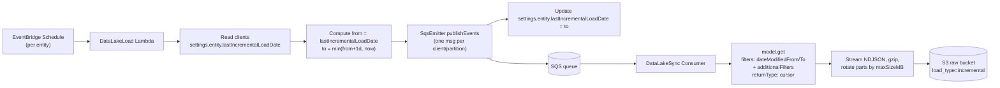
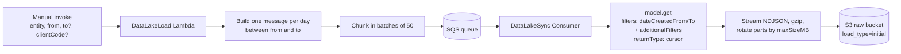
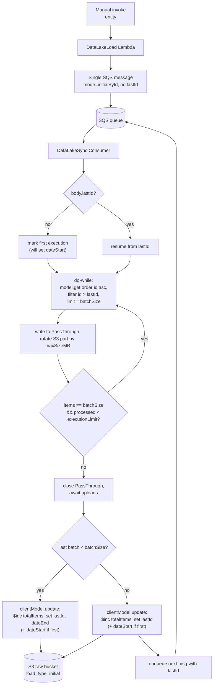

# Data Lake

[Build Status](https://github.com/janis-commerce/data-lake/actions)
[Coverage Status](https://coveralls.io/github/janis-commerce/data-lake?branch=master)

Package to send data from Janis microservices to the **Janis Data Lake** service.

## What it does

The package orchestrates **initial** and **incremental** syncs of entity data: a scheduled Lambda enqueues load messages per client; an SQS consumer reads those messages, queries the service model by date range, and uploads the results to S3 as compressed NDJSON (`.ndjson.gz`). The Data Lake then ingests from that raw bucket.

**Flow:** EventBridge Scheduler → **DataLakeLoad** Lambda → SQS → **DataLakeSync** Consumer → S3 (raw bucket).

## Installation

```bash
npm install @janiscommerce/data-lake
```

> **Warning:** The consumer uses `returnType: 'cursor'` on the model `get()`. Your service must use **@janiscommerce/mongodb** version **3.14.0** or higher, where cursor support was added.

<details>

<summary><strong>Flows</strong></summary>

### Incremental load

Triggered automatically by EventBridge on a schedule per entity. For each active client, the Lambda computes a date window from the last watermark and enqueues one message.



### Initial load by `dateCreated`

Triggered manually by invoking the Lambda with `entity` and `from` (and optionally `to`). The Lambda fans out one message per day in the date range.



### Initial load by id

Used when the entity does not have a `dateCreated` index. A single message is sent; the consumer iterates in batches ordered by `_id`, saves progress in the client settings, and re-enqueues itself until all documents are exported.



</details>

## Usage in a Janis service

To enable Data Lake sync in a microservice, follow these steps.

---

### 1. Add the hooks

Register the Data Lake hooks in your Serverless config so the Lambda, SQS queue, consumer, schedules, and IAM roles are created.

You need to pass `SQSHelper` from `sls-helper-plugin-janis` into the hooks.

**File: `serverless.js` (or where you define `helper`)**

```js
'use strict';

const { helper } = require('sls-helper');
const { SQSHelper } = require('sls-helper-plugin-janis');
const { dataLakeServerlessHelperHooks } = require('@janiscommerce/data-lake');

module.exports = helper({
	hooks: [
		// ... other hooks (api, functions, etc.)
		...dataLakeServerlessHelperHooks(SQSHelper)
	]
});
```

**What this adds:**

- Lambda **DataLakeLoad** (handler: `src/lambda/DataLakeLoad/index.js`)
- SQS queue and consumer Lambda for **dataLakeSync** (handler: `src/sqs-consumer/data-lake-sync-consumer.js`)
- EventBridge Schedule Group and one Schedule per entity (from Settings), invoking the Lambda with `mode: 'incremental'` and `entity` in kebab-case
- IAM role for the scheduler to invoke the Lambda

---

### 2. Add the DataLakeLoad Lambda

Create the Lambda handler that extends the package class. It must live at the path expected by the hooks: **`src/lambda/DataLakeLoad/index.js`**.

**File: `src/lambda/DataLakeLoad/index.js`**

```js
'use strict';

const { Handler } = require('@janiscommerce/lambda');
const { DataLakeLoadFunction } = require('@janiscommerce/data-lake');

module.exports.handler = (...args) => Handler.handle(DataLakeLoadFunction, ...args);

```

**Payload:** The Lambda receives a payload with `entity` and optionally `mode`, `from`, `to`, `limit`, `maxSizeMB`. The schedules send `{ mode: 'incremental', entity: "<entity-kebab-case>" }`. For an **initial load by date range** you must invoke the Lambda manually with `entity` and `from` (and optionally `to`, `limit`, `maxSizeMB`). For an **initial load by id** the entity setting `initialLoad.byId: true` determines the mode automatically. Sync messages sent to SQS can also carry **`additionalFilters`** and **`filenamePrefix`** when you override `prepareIncrementalMessages` (see below).

**Performance:** The Lambda reuses a single `SqsEmitter` instance across all clients in a single invocation, avoiding file descriptor exhaustion (`EMFILE` errors) when processing hundreds or thousands of clients. Initial load messages are prepared once and reused for all clients.

### Partitioning incremental loads (optional)

Some entities need **compound query filters** (for example, to match a MongoDB index) while still using the same incremental **date range** (`dateModifiedFrom` / `dateModifiedTo`). In that case the microservice can **split one incremental run into several SQS messages** by overriding `prepareIncrementalMessages` on **`DataLakeLoadFunction`**.

**Default behavior:** `prepareIncrementalMessages(clientCode, content)` returns `[{ content }]` — one queue message per client per scheduled incremental run.

**Override:** Return an array of objects shaped like `{ content: { ... } }`, each `content` being a full sync payload. The **Data Lake Sync** consumer merges optional **`additionalFilters`** into the model `get()` filters together with the date-range filters.

**`content` shape (incremental)** — usually you spread the incoming `content` and add fields per message:

| Field                 | Type          | Description                                                                                                                       |
| --------------------- | ------------- | --------------------------------------------------------------------------------------------------------------------------------- |
| `entity`              | string        | Entity in kebab-case (same as settings).                                                                                          |
| `mode`                | string        | `'incremental'` — set automatically by the base class.                                                                          |
| `from`                | Date or string | Start of range (provided by the base class; serializes to ISO when sent to SQS).                                                 |
| `to`                  | Date or string | End of range.                                                                                                                     |
| `additionalFilters`   | object        | **Optional.** Merged into the consumer’s `filters` (e.g. `{ warehouse: id }`). Keys must match what your model’s `get()` expects. |
| `filenamePrefix`      | string        | **Optional.** Prepended to the S3 object file name (with a trailing `-`) so partitioned runs for the same window do not collide (e.g. `warehouse-123`). |

**Consumer:** See `DataLakeSyncConsumer` — it validates `additionalFilters` as an optional object and applies it alongside `dateModifiedFrom` / `dateModifiedTo` (incremental) or `dateCreatedFrom` / `dateCreatedTo` (initial). Optional `filenamePrefix` is applied to uploaded `.ndjson.gz` keys: `…/<prefix>-<from>-<pushedAt>-<part>.ndjson.gz` (omit `filenamePrefix` for the default `…/<from>-<pushedAt>-<part>.ndjson.gz`).

**Client watermark:** After a successful publish, the base class updates **`settings.<entity>.lastIncrementalLoadDate`** to `to` for that client. If you emit **multiple** messages from `prepareIncrementalMessages`, they are published in **one** `publishEvents` batch for that client; the watermark advances only when that batch succeeds (no partial update on failure).

**Initial load:** Partitioning is only documented here for **incremental** flows. Initial load still uses the built-in per-day messages from `sendInitialLoadMessages` unless you extend that path separately.

**Example:** one incremental message per warehouse for entity `stock`:

```js
'use strict';

const { Handler } = require('@janiscommerce/lambda');
const { DataLakeLoadFunction } = require('@janiscommerce/data-lake');
const { ApiSession } = require('@janiscommerce/api-session');

const WarehouseModel = require('../../models/warehouse');

class WMSDataLakeLoadFunction extends DataLakeLoadFunction {

	async prepareIncrementalMessages(clientCode, content) {

		if(content.entity !== 'stock')
			return [{ content }];

		const session = new ApiSession({ clientCode });

		const warehouseModel = session.getSessionInstance(WarehouseModel);

		const messages = [];

		await warehouseModel.getPaged({
			fields: ['id'],
			readPreference: 'secondary'
		}, warehouses => {
			warehouses.forEach(({ id }) => {
				messages.push({
					content: {
						...content,
						additionalFilters: { warehouse: id },
						filenamePrefix: `warehouse-${id}`
					}
				});
			});
		});

		return messages;
	}
}

module.exports.handler = (...args) => Handler.handle(WMSDataLakeLoadFunction, ...args);

```

---

### 3. Add the Data Lake Sync consumer

Create the SQS consumer file at the path expected by the hooks: **`src/sqs-consumer/data-lake-sync-consumer.js`**.

**File: `src/sqs-consumer/data-lake-sync-consumer.js`**

```js
'use strict';

const { SQSHandler } = require('@janiscommerce/sqs-consumer');
const { DataLakeSyncConsumer } = require('@janiscommerce/data-lake');

module.exports.handler = event => SQSHandler.handle(DataLakeSyncConsumer, event);

```

This re-exports the package consumer handler. The consumer reads messages from the Data Lake sync queue, loads data from your model (by `entity` and date range, plus optional `additionalFilters`), and uploads NDJSON.gz to S3. Optional **`filenamePrefix`** on the message body changes the uploaded object key so parallel or split runs stay distinguishable in the raw bucket.

**Options:** The consumer uses `IterativeSQSConsumer` (one record per invocation when `batchSize: 1`).

---

### 4. Add settings for entities to sync

Configure which entities are synced and how often (in minutes). Settings are read from your service config (e.g. `environments/{environment}/.janiscommercerc.json` by `@janiscommerce/settings`).

**File: `src/environments/{environment}/.janiscommercerc.json`**

```json
{
	"dataLake": {
		"entities": [{
			"name": "order",
			"frequency": 60,
			"initialLoad": {
				"dateFrom": "2025-01-01 00:00:00"
			}
		}, {
			"name": "product",
			"frequency": 120,
			"initialLoad": {
				"dateFrom": "2025-01-01 00:00:00"
			}
		}]
	}
}
```

**Entity options:**


| Property          | Type   | Required | Description                                                                                                                                                                                                                              | Since   |
| ----------------- | ------ | -------- | ---------------------------------------------------------------------------------------------------------------------------------------------------------------------------------------------------------------------------------------- | ------- |
| `name`            | string | Yes      | Entity name in **kebab-case**. Must match the model path: the package loads the model from `models/<name>.js` (e.g. `order` → `models/order.js`). This same value is sent in the payload as `entity`.                                    | `1.0.0` |
| `frequency`       | number | No       | How often (in minutes) to run the incremental sync. Default: `60`. Used in the Schedule expression: `rate(<frequency> minutes)`.                                                                                                         | `1.0.0` |
| `fields`          | array  | No       | If set, only these fields are requested from the model in the consumer (reduces payload size and control what goes to the Data Lake).                                                                                                    | `1.0.0` |
| `excludeFields`   | array  | No       | If set, these fields are excluded from the model in the consumer (reduces payload size and control what goes to the Data Lake).                                                                                                          | `1.1.0` |
| `readPreference`  | string | No       | MongoDB read preference passed to the model `get()` call. Default: `'secondary'`. Requires **@janiscommerce/mongodb 3.17.0** or higher.                                                                                                 | `1.4.0` |
| `hint`            | object \| string | No       | MongoDB index hint passed to the model `get()` call. Can be an index spec object (e.g. `{ dateModified: 1, warehouse: 1 }`) or the index name as a string (e.g. `"dateModified_1_warehouse_1"`).                               | `1.5.0` |
| `initialLoad.dateFrom` | string | No | Valid date string (e.g. `YYYY-MM-DD HH:mm:ss` or ISO). Used as the starting date for incremental sync when the client has no `settings.<entity>.lastIncrementalLoadDate`. Required when not using `initialLoad.byId`. | `1.6.0` |
| `initialLoad.byId` | boolean | No | When `true`, switches the initial load strategy to `_id`-based pagination. A single SQS message is sent with `mode: 'initialById'`; the consumer queries ordered by `id: 'asc'` and auto-paginates via `lastId`. Mutually exclusive with `initialLoad.dateFrom`. | `1.6.0` |
| `initialLoad.batchSize` | number | No | Number of documents fetched per iteration inside one consumer execution in `initialLoadById` mode. Default: `10000`. | `1.6.0` |
| `initialLoad.executionLimit` | number | No | Maximum total documents processed in a single consumer invocation in `initialLoadById` mode. When reached, the consumer automatically re-queues the next page with the last processed `_id`. Default: `100000`. | `1.6.0` |
| `maxSizeMB` | number | No | Maximum size in MB of the S3 files. Default: `500`. | `1.6.0` |

**Example with `fields`, `excludeFields` and `initialLoad.dateFrom`:**

```json
{
	"dataLake": {
		"entities": [
			{
				"name": "order",
				"frequency": 30,
				"initialLoad": {
					"dateFrom": "2025-01-01 00:00:00"
				},
				"fields": ["id", "commerceId", "total", "status"]
			}
		]
	}
}
```

**Important:** `dataLake.entities` is **required**. If it is missing, the hooks will throw at load time: `dataLake.entities is required in Settings file`. Each entity must have a model at `models/<name>.js` and the model must support `get()` with filters `dateCreatedFrom`/`dateCreatedTo` (initial) or `dateModifiedFrom`/`dateModifiedTo` (incremental) and `returnType: 'cursor'`.

---

### Manual execution: initial load

To run an **initial load** (full export by date range or by `_id`) you must invoke the **DataLakeLoad** Lambda manually. The payload must include the entity and the start date; end date and client are optional (default: all active clients, up to today).

**Payload:**


| Field               | Type    | Required | Description                                                                                                                                           | Since   |
| ------------------- | ------- | -------- | ----------------------------------------------------------------------------------------------------------------------------------------------------- | ------- |
| `entity`            | string  | Yes      | Entity name in kebab-case (e.g. `order`, `product`).                                                                                                  | `1.0.0` |
| `mode`              | string  | Yes      | Use `'initial'` for initial load by date range or by `_id`. Default: `'initial'`.                                        | `1.6.0` |
| `from`              | string  | No      | Start date (valid date string, e.g. `YYYY-MM-DD HH:mm:ss` or ISO).                                                                                    | `1.0.0` |
| `to`                | string  | No       | End date. Default: today end of day.                                                                                                                  | `1.0.0` |
| `clientCode`        | string  | No       | If set, only this client is synced; otherwise all active clients.                                                                                     | `1.0.0` |

**Example: all clients, from a given date to today**

```json
{
  "body": {
    "entity": "order",
    "mode": "initial",
    "from": "2025-01-01 00:00:00"
  }
}
```

**Example: with end date and a single client**

```json
{
  "body": {
    "entity": "product",
    "from": "2025-01-01 00:00:00",
    "to": "2025-06-30 23:59:59",
    "clientCode": "my-client-code"
  }
}
```

---

### Initial load by id (for large collections without `dateCreated` index)

When an entity has `initialLoad.byId: true` in its settings, the Lambda sends a **single SQS message** with `mode: 'initialById'` (no date range) and the consumer iterates through all documents ordered by `_id` in a do-while loop:

1. Each consumer invocation runs a do-while loop, fetching `initialLoad.batchSize` documents per iteration (default `10000`), ordered by `id: 'asc'` with an `id > lastId` filter when continuing from a previous execution.
2. The loop continues until either the last batch returns fewer documents than `batchSize` (all documents exported) or the total processed in the current invocation reaches `initialLoad.executionLimit` (default `100000`).
3. When `executionLimit` is reached, the consumer **automatically re-queues** a new SQS message with the last processed `_id` as `lastId` to continue in the next invocation.
4. Progress is persisted in the client settings after each invocation (see below).

**Client settings updated automatically:**

| Key | Set when |
| --- | --- |
| `settings.<entity>.initialLoad.dateStart` | First invocation (no `lastId` in the message) |
| `settings.<entity>.initialLoad.lastId` | Every invocation that processes at least one document |
| `settings.<entity>.initialLoad.totalItems` | Every invocation, incremented by the count processed in that run |
| `settings.<entity>.initialLoad.dateEnd` | Last invocation (last batch returned fewer documents than `batchSize`) |

**Settings example:**

```json
{
	"dataLake": {
		"entities": [{
			"name": "stock",
			"frequency": 60,
			"initialLoad": {
				"byId": true,
				"batchSize": 10000,
				"executionLimit": 100000
			}
		}]
	}
}
```

**Manual invocation payload** (only `entity` is required; `maxSizeMB` is optional):

```json
{
  "body": {
    "entity": "stock"
  }
}
```

> **Note:** `initialLoad.byId` is mutually exclusive with `initialLoad.dateFrom`-based initial load. When `initialLoad.byId` is set, the `from`/`to` payload fields and the `initialLoad.dateFrom` setting are ignored.

---

## Environment variables

- **`DATA_LAKE_SYNC_SQS_QUEUE_URL`** – Set by the hooks (SQS queue URL for the sync queue). The DataLakeLoad Lambda publishes messages here.
- **`S3_DATA_LAKE_RAW_BUCKET`** – Set by the hooks on the consumer Lambda (e.g. `janis-data-lake-service-raw-${stage}`). The consumer uploads NDJSON.gz files here.

